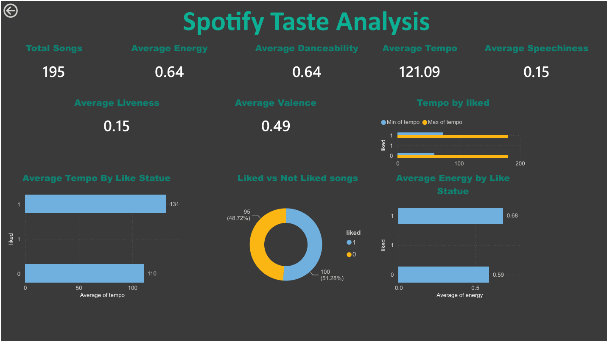

# 🎵 Spotify Music Taste Analysis

## 📊 Project Overview

This project analyzes Spotify audio features to identify patterns in music preferences and listening behavior.

The analysis was completed using **Python, Pandas, Excel, SQL, and Power BI**, covering data cleaning and preparation, exploratory analysis, SQL-based analysis, and interactive dashboard reporting.

The project demonstrates an end-to-end data analytics workflow, from raw data cleaning and preparation to business-oriented analysis, visualization, and reporting.
---

## 🎯 Project Objective

The objective of this project is to analyze Spotify audio features and identify patterns in music preferences using structured data analysis and visualization techniques.

The project focuses on understanding relationships between audio characteristics and music preferences through:

- Data cleaning and preparation using Python and Pandas
- Exploratory analysis
- SQL queries
- Excel-based analysis and dashboarding
- Power BI visualization
- Interactive reporting

---

## 🗂️ Dataset

The project uses a Spotify dataset containing audio features associated with music tracks.

The repository includes both the original and cleaned datasets:

- `spotify_raw.csv` – original dataset
- `spotify_cleaned.csv` – cleaned and prepared dataset used for analysis

---

## 🧹 Data Preparation

The raw Spotify dataset was cleaned and prepared using **Python and Pandas** before being used for further analysis.

The workflow included:

- Reviewing the raw Spotify dataset
- Using Python and Pandas to clean and prepare the data
- Creating the cleaned dataset used for analysis
- Using the cleaned dataset for Excel, SQL, and Power BI analysis

This demonstrates the workflow:

**Raw Data → Python/Pandas Cleaning → Cleaned Data → Analysis & Visualization**

---

## 🔍 Analysis

The project includes analysis performed using both Excel and SQL.

### Excel Analysis

Excel was used for:

- Data preparation
- Data analysis
- Lookup functions
- Pivot tables
- Dashboard creation
- Visualization and reporting

The Excel workbook is available here:

[View Excel Analysis Workbook](excel/spotify_analysis.xlsx)

A clean PDF export of the Excel dashboard is available here:

[View Excel Dashboard PDF](excel/spotify_excel_dashboard.pdf)

---

### SQL Analysis

SQL was used to analyze the Spotify dataset and investigate audio-feature patterns.

The SQL analysis includes calculations and comparisons involving:

- Tempo
- Energy
- Danceability
- Loudness
- Speechiness
- Liveness
- Valence
- Liked vs. non-liked tracks
- Relationships between selected audio features

The SQL queries are available here:

[View SQL Analysis Queries](sql/spotify_analysis.sql)

Supporting query results and output screenshots are available here:

[View SQL Analysis Results](sql/SQL_Analysis_Results.docx)

---

## 📈 Power BI Dashboard

The Power BI report was created to present the analysis through interactive visualizations and dashboard reporting.

### Dashboard Preview



The complete Power BI report is available here:

[View Power BI Report](powerbi/spotify_taste_analysis.pbix)

A PDF version of the Power BI dashboard is available here:

[View Power BI Dashboard PDF](dashboard/spotify_powerbi_dashboard.pdf)

Additional Power BI report pages are available in the `images/` folder.

---

## 📌 Key Insights

The analysis identified several patterns in the Spotify dataset:

### Overall Audio Characteristics

- The average track tempo was **121.09 BPM**, with tracks ranging from **60.2 BPM to 180 BPM**.
- Average **energy and danceability were both 0.64**, indicating relatively moderate-to-high average levels of energy and danceability in the dataset.
- The average **valence was 0.49**, suggesting a fairly balanced distribution of musical positivity.
- Average **speechiness and liveness were both 0.15**.
- The average track duration was approximately **3 minutes 33 seconds**, with durations ranging from approximately **1 minute 17 seconds to 10 minutes 55 seconds**.

### Liked vs. Non-Liked Tracks

The analysis showed noticeable differences between liked and non-liked tracks:

- **Liked tracks had higher average danceability**, at **0.76** compared with **0.51** for non-liked tracks.
- **Liked tracks had a higher average tempo**, at **131.22 BPM** compared with **110.42 BPM**.
- **Liked tracks showed higher average energy**, at **0.68** compared with **0.59**.
- **Liked tracks had higher average valence**, at **0.56** compared with **0.42**.
- **Liked tracks were louder on average**, with loudness of **-6.88** compared with **-12.22** for non-liked tracks.
- **Speechiness was higher among liked tracks**, at **0.22** compared with **0.08**.
- Average **liveness was the same for both groups at 0.15**.

### Relationship Analysis

- The project explored the relationship between **energy and danceability** using a scatter plot.
- The project also explored the relationship between **energy and valence**.
- These visualizations were used to examine patterns among selected Spotify audio features.

---

## 🛠️ Tools & Technologies

| Tool | Purpose |
|---|---|
| Python | Data cleaning and preparation |
| Pandas | Data manipulation and cleaning |
| Excel | Data analysis, Pivot Tables, dashboarding |
| SQL | Data analysis and querying |
| Power BI | Interactive visualization and dashboard reporting |

---

## 📁 Project Structure

```text
spotify-music-taste-analysis/
│
├── data/
│   ├── spotify_raw.csv
│   └── spotify_cleaned.csv
│
├── dashboard/
│   └── spotify_powerbi_dashboard.pdf
│
├── excel/
│   ├── spotify_analysis.xlsx
│   └── spotify_excel_dashboard.pdf
│
├── images/
│   ├── spotify_powerbi_page_01.png
│   ├── spotify_powerbi_page_02.png
│   ├── spotify_powerbi_page_03.png
│   └── spotify_powerbi_page_04.png
│
├── powerbi/
│   └── spotify_taste_analysis.pbix
│
├── sql/
│   ├── spotify_analysis.sql
│   └── SQL_Analysis_Results.docx
│
└── README.md
```

💡 Key Skills Demonstrated
- Python & Pandas Data Cleaning
- Data Preparation
- Exploratory Data Analysis
- Excel Data Analysis
- SQL Querying
- Data Visualization
- Dashboard Development & Reporting
- Power BI Reporting
- Analytical Thinking
- Data Storytelling

👩‍💻 Author

Naseema Begam MA

Aspiring Data Analyst

Skills: Excel | SQL | Power BI | Python | Pandas | Statistics | Tableau

📌 Project Status

Completed as a portfolio data analytics project.
